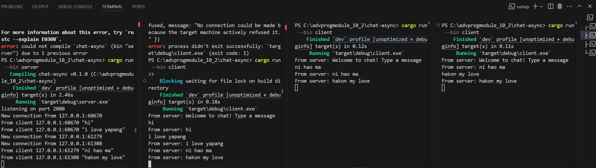

## Original code, and how it runs


How to run chat: Set up 4 terminals
- 1 terminal will be used as the server, run 
```bash
cargo run --bin server
```
- 3 terminals will be used as the clients, run 
```bash
 cargo run --bin client
 ```

 From the screenshot above, we can observe that when a client sends a message, the server receives it and broadcasts it to all connected clients, including the sender. This works because the server keeps track of every connected client and listens for messages. Once a message is received from any client, the server forwards it to all active connections.

## Modifying ports
To modify the port on the server, we need to change the ```TCPListener``` port number in the ```server.rs``` file. We also needed to change the port number in the ```client.rs``` file to match the server's port number. 

The WebSocket protocol isn't explicitly declared on the server side. Instead, the server binds a port using a TCPListener, which listens for incoming TCP connections. Once a connection is established, the server creates a socket and passes it to a WebSocket handler. While the server doesn't directly state that it's using the WebSocket protocol, it effectively implements the WebSocket specification through the tokio-websocket crate.